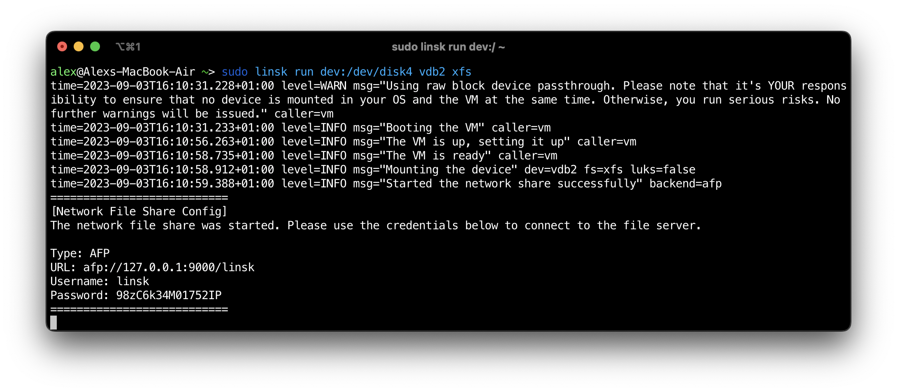

# Linsk

<a href="https://t.me/linsk_foss"></a>

**Linsk** 是一个允许你在 Windows 和 macOS 上访问 Linux 原生文件系统基础设施（包括 LVM 和 LUKS）的实用工具。与其他旨在非 Linux 系统上访问 Linux 文件系统的解决方案不同，Linsk 不重新实现任何文件系统。相反，Linsk 利用轻量级的 Alpine Linux 虚拟机（仅约 130 MB）结合网络共享技术（如 SMB、AFP 和 FTP）来实现访问。

由于 Linsk 使用原生 Linux 虚拟机，因此没有任何访问限制。任何在 Linux 上能工作的功能在 Linsk 下也能工作（因此得名 Linux+Disk）。

如果你觉得这个项目有用，请给本仓库点星以表示感谢。



# 💻 支持的平台

## CPU 架构
Linsk 原生支持 **x86_64**（即 amd64、Intel、AMD 等）和 **aarch64**（即 arm64、Apple M1/M2 等）。

虽然 Linsk 使用虚拟机，但 CPU 从不被模拟，而是使用硬件加速器如 HVF（macOS）、WHPX（Windows）和 KVM（Linux）。

## 操作系统

* **Windows**
* **macOS**
* **Linux**（主要用于开发目的）

## 网络文件共享后端

Linsk 依赖网络文件共享向主机暴露文件。以下是 Linsk 支持的网络共享类型：

* **SMB** - Windows 的默认选项。
* **AFP** - macOS 的默认选项。
* **FTP** - 替代后端。

# 💿 安装

- **Windows** - 参见 [INSTALL_WINDOWS.md](INSTALL_WINDOWS.md)。
- **macOS** - 参见 [INSTALL_MACOS.md](INSTALL_MACOS.md)。
- **Linux** - 参见 [LINUX_DEV_ENV.md](LINUX_DEV_ENV.md)。

# 🔧 使用

- **Windows** - 参见 [USAGE_WINDOWS.md](USAGE_WINDOWS.md)。
- **macOS** - 参见 [USAGE_MACOS.md](USAGE_MACOS.md)。

# ⚠️ 严重漏洞披露（过时版本）

低于 **v0.2.0** 的 Linsk 版本被视为过时版本，**除非**：
* Linsk 的使用仅限于具有 512 字节逻辑块（扇区）大小的设备；**或**
* 使用了实验性的 USB 透传功能。

更多信息：[serious-bug-disclosures/README.md](serious-bug-disclosures/README.md)

# 👨‍💻 贡献

请参见 [CONTRIBUTING.md](CONTRIBUTING.md)。

# ©️ 版权和许可证

版权所有 (c) 2023 The Linsk Authors。

根据 GNU General Public License v3 提供。许可证副本包含在 LICENSE 文件中。

使用以下 `git` 命令查看 Linsk 作者列表：
```sh
git log --format='%aN <%aE>' | sort -uf
```

---

# 本分支功能修改说明

本分支在原始 Linsk 基础上进行了以下修改，以支持**离线环境**和**更便捷的自动化使用**：

## 1. 资源文件嵌入二进制

原始 Linsk 在首次运行时需要从网络下载 Alpine ISO 镜像和 EFI BIOS 文件。本分支将这些资源文件嵌入到二进制中，使程序可以在**完全离线的机器**上运行。

嵌入的资源文件包括：
* **Alpine 基础 ISO 镜像**（x86_64 / aarch64）— 约 49-69 MB
* **aarch64 EFI BIOS**（arm64 架构需要）— 约 64 MB
* **APK 包缓存**（可选，用于离线构建 VM 镜像）— 约 28 MB

编译前需将资源文件放入 `assets/files/` 目录，详见 [TEST-GUIDE.md](TEST-GUIDE.md)。

## 2. 固定共享密码

原始 Linsk 每次启动网络共享时都会生成随机密码。本分支将密码固定为 **`linsk`**，便于自动化脚本和开机自启动配置。

## 3. 修复 FTP 写入权限

修复了 FTP 共享模式下 `/mnt` 挂载点权限问题，确保通过 FTP 连接后可以正常读写文件。

## 4. 新增测试指南

新增 [TEST-GUIDE.md](TEST-GUIDE.md)，包含：
* 离线编译步骤
* LVM + ext4 创建和测试流程
* FTP/SMB/AFP 共享访问方法
* 常见问题排查
